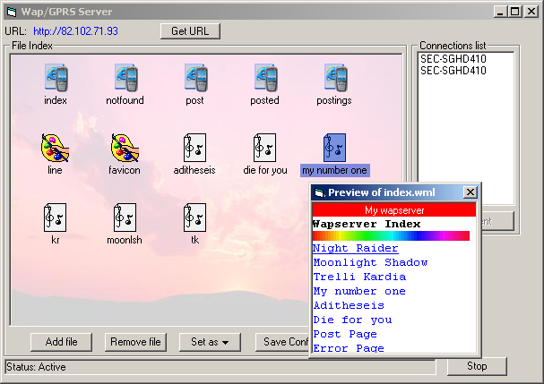



## GPRS WAP Server

### Description

A complete WAP and GPRS server that serves wml documents and applications to any GPRS/WAP enabled cellphone. Supports Images, Sounds, Applications (jar/sic) downloading, posting

full log of requests.
 
### More Info
 

             |
---                |---
**Submitted On**   |2005-12-31 17:49:48
**By**             |[Lefteris Eleftheriades](https://github.com/Planet-Source-Code/PSCIndex/blob/master/ByAuthor/lefteris-eleftheriades.md)
**Level**          |Intermediate
**User Rating**    |4.5 (18 globes from 4 users)
**Compatibility**  |VB 6\.0
**Category**       |[Internet/ HTML](https://github.com/Planet-Source-Code/PSCIndex/blob/master/ByCategory/internet-html__1-34.md)
**World**          |[Visual Basic](https://github.com/Planet-Source-Code/PSCIndex/blob/master/ByWorld/visual-basic.md)
**Archive File**   |[GPRS\_WAP\_S196203132006\.zip](https://github.com/Planet-Source-Code/lefteris-eleftheriades-gprs-wap-server__1-63907/archive/master.zip)

